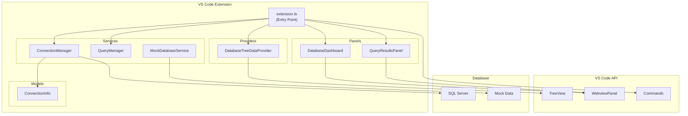

# Open Data Studio - Project Documentation

> **Complete technical documentation of the Open Data Studio VS Code extension**

---

## Table of Contents

1. [Overview](#overview)
2. [Project Structure](#project-structure)
3. [Architecture](#architecture)
4. [Core Components](#core-components)
5. [Commands & Features](#commands--features)
6. [Data Models](#data-models)
7. [Services](#services)
8. [UI Panels](#ui-panels)
9. [Dependencies](#dependencies)
10. [Development Setup](#development-setup)

---

## Overview

**Open Data Studio** is an open-source Visual Studio Code extension that brings Azure Data Studio-like database management features directly into VS Code. It provides a comprehensive SQL development experience with connection management, database exploration, query execution, and more.

| Property | Value |
|----------|-------|
| **Name** | `open-data-studio` |
| **Display Name** | Open Data Studio |
| **Version** | 0.0.1 |
| **VS Code Compatibility** | ^1.85.0 |
| **License** | MIT |

---

## Project Structure

```
Open-Data-Studio/
├── .vscode/                    # VS Code workspace settings
├── out/                        # Compiled JavaScript output
├── src/                        # Source code (TypeScript)
│   ├── extension.ts            # Main entry point
│   ├── models/                 # Data interfaces
│   │   └── ConnectionInfo.ts   # Connection data model
│   ├── panels/                 # Webview UI panels
│   │   ├── DatabaseDashboard.ts    # Database dashboard panel
│   │   └── QueryResultsPanel.ts    # Query results display
│   ├── providers/              # VS Code data providers
│   │   └── DatabaseTreeDataProvider.ts  # Tree view provider
│   └── services/               # Business logic services
│       ├── ConnectionManager.ts    # Database connection handling
│       ├── MockDatabaseService.ts  # Mock data for testing
│       └── QueryManager.ts         # Query document management
├── package.json                # Extension manifest
├── tsconfig.json               # TypeScript configuration
├── README.md                   # User-facing documentation
└── DEVELOPMENT.md              # Developer guide
```

---

## Architecture



### Activation Flow

1. Extension activates on `onView:openDataExplorer` or `open-data-studio.helloWorld` command
2. `DatabaseTreeDataProvider` is registered to populate the sidebar
3. `ConnectionManager` is initialized with the extension context
4. Commands are registered for user interactions

---

## Core Components

### extension.ts

The **main entry point** that orchestrates the entire extension.

**Key Functions:**

| Function | Purpose |
|----------|---------|
| `activate(context)` | Initializes providers, services, and registers commands |
| `deactivate()` | Cleanup when extension is deactivated |
| `generateCreateTableScript()` | Helper to generate SQL CREATE TABLE statements |
| `getDataTypeString()` | Formats SQL data types with size/precision |

---

## Commands & Features

### Registered Commands

| Command ID | Title | Description |
|------------|-------|-------------|
| `open-data-studio.helloWorld` | Hello World | Test command to verify extension is active |
| `open-data-studio.openDashboard` | Open Dashboard | Opens database dashboard webview |
| `open-data-studio.addConnection` | Add Connection | Wizard to add new SQL Server connection |
| `open-data-studio.deleteConnection` | Delete Connection | Removes a saved connection |
| `open-data-studio.newQuery` | New Query | Opens SQL editor for selected database |
| `open-data-studio.runQuery` | Run Query | Executes SQL query and shows results |
| `open-data-studio.scriptTableAsCreate` | Script as CREATE | Generates CREATE TABLE statement for table |

### Context Menus

| Context | Commands Available |
|---------|-------------------|
| **Server** (right-click) | Delete Connection |
| **Database** (right-click) | Open Dashboard, New Query |
| **Table** (right-click) | Script as CREATE |

### Views

| View ID | Location | Purpose |
|---------|----------|---------|
| `openDataExplorer` | Activity Bar (`open-data-studio-sidebar`) | Database connection tree explorer |

---

## Data Models

### ConnectionInfo

Interface defining database connection parameters.

```typescript
interface ConnectionInfo {
    id: string;                           // Unique identifier
    label: string;                        // Display name (server name)
    server: string;                       // SQL Server host/IP
    authenticationType: 'SqlLogin' | 'Integrated';
    user?: string;                        // Username (SqlLogin only)
    password?: string;                    // Password (stored securely)
    database?: string;                    // Default database
    port?: number;                        // Connection port
}
```

---

## Services

### ConnectionManager

Singleton service managing SQL Server connections (located in `src/services/ConnectionManager.ts`).

**Capabilities:**

| Method | Description |
|--------|-------------|
| `getInstance(context?)` | Get/create singleton instance |
| `addConnection(connection)` | Save new connection to global state |
| `getConnectionsMetadata()` | Retrieve all saved connections (without passwords) |
| `getConnectionWithPassword(id)` | Get connection with password from secure storage |
| `connect(connectionId)` | Establish database connection pool |
| `getDatabases(connectionId)` | Fetch list of databases from server |
| `getTableSchema(connectionId, db, table)` | Get column definitions for table |
| `deleteConnection(connectionId)` | Remove connection and cleanup |

**Authentication Support:**

- **SQL Login**: Username/password authentication via `mssql` package
- **Windows Authentication**: Integrated security via `msnodesqlv8` (ODBC Driver 17)

**Connection String Format (Integrated):**
```
Driver={ODBC Driver 17 for SQL Server};Server=<server>;Database=<db>;Trusted_Connection=Yes;TrustServerCertificate=Yes;
```

---

### QueryManager

Singleton service tracking SQL documents and their database context (located in `src/services/QueryManager.ts`).

| Method | Description |
|--------|-------------|
| `getInstance()` | Get singleton instance |
| `registerQueryDocument(uri, connectionId, dbName)` | Associate document with connection |
| `getConnectionForDocument(uri)` | Get connection context for document |
| `removeDocument(uri)` | Unregister document |

---

### MockDatabaseService

Static service providing test data for development (located in `src/services/MockDatabaseService.ts`).

| Method | Returns |
|--------|---------|
| `getMockTables()` | 15 sample table names across schemas |
| `getMockStoredProcedures()` | 12 sample stored procedures |
| `executeMockQuery(query)` | Simulated query results (5 rows) |
| `getMockTableSchema(tableName)` | Column definitions for mock tables |

**Mock Schemas Available:** `Users`, `Products`, `Orders`, `Employees`

---

## UI Panels

### DatabaseDashboard

Webview panel showing database overview (located in `src/panels/DatabaseDashboard.ts`).

**Features:**
- Displays tables and stored procedures
- Search/filter functionality
- Single-instance pattern (reuses existing panel)
- VS Code theme integration

**Singleton Pattern:**
- `createOrShow()` - Creates new panel or updates existing
- `_update()` - Updates panel content for a different database

---

### QueryResultsPanel

Webview panel displaying SQL query results in a table (located in `src/panels/QueryResultsPanel.ts`).

**Features:**
- Dynamic table rendering from query results
- Column headers auto-generated from result set
- Alternating row colors for readability
- Opens in `ViewColumn.Two` (side panel)

---

## Dependencies

### Runtime Dependencies

| Package | Version | Purpose |
|---------|---------|---------|
| `mssql` | ^12.2.0 | SQL Server database driver |
| `msnodesqlv8` | ^5.1.3 | Native ODBC driver for Windows Auth |

### Development Dependencies

| Package | Version | Purpose |
|---------|---------|---------|
| `typescript` | ^5.1.3 | TypeScript compiler |
| `@types/vscode` | ^1.85.0 | VS Code API types |
| `@types/mssql` | ^9.1.8 | MSSQL package types |
| `eslint` | ^8.41.0 | Code linting |
| `mocha` | ^10.2.0 | Test framework |
| `@vscode/test-electron` | ^2.3.2 | VS Code extension testing |

---

## Development Setup

### Prerequisites

- Node.js v16+
- Visual Studio Code
- ODBC Driver 17 for SQL Server (for Windows Authentication)

### Quick Start

```bash
# Clone repository
git clone https://github.com/lsegecode/Open-Data-Studio.git
cd Open-Data-Studio

# Install dependencies
npm install

# Compile TypeScript
npm run compile

# Run in debug mode (F5 in VS Code)
```

### Available Scripts

| Script | Command | Description |
|--------|---------|-------------|
| `compile` | `npm run compile` | Compile TypeScript to JavaScript |
| `watch` | `npm run watch` | Watch mode for development |
| `lint` | `npm run lint` | Run ESLint on source files |
| `test` | `npm run test` | Run test suite |
| `vscode:prepublish` | Auto | Compiles before publishing |

### Debugging

1. Open project in VS Code
2. Press **F5** to launch Extension Development Host
3. The extension sidebar appears in the new VS Code window
4. Test features via the "Open Data Studio" sidebar icon

---

## Feature Summary

| Feature | Status | Notes |
|---------|--------|-------|
| Activity Bar Integration | ✅ Complete | Dedicated sidebar |
| Connection Management | ✅ Complete | Add/delete connections |
| Database Explorer | ✅ Complete | Tree view navigation |
| Database Dashboard | ✅ Complete | Tables & procedures overview |
| Search/Filter | ✅ Complete | Dashboard search bar |
| Query Editor | ✅ Complete | SQL document creation |
| Query Execution | ⚠️ Partial | Mock data only |
| Script as CREATE | ✅ Complete | Generate CREATE TABLE |
| Windows Auth | ✅ Complete | ODBC Driver 17 |
| SQL Login Auth | ✅ Complete | Standard mssql driver |

---

## AI Development Disclaimer

This extension is developed with AI assistance. Every change is reviewed, tested, and accepted by human maintainers. See [DEVELOPMENT.md](DEVELOPMENT.md) for more details.

---

*Documentation generated for Open Data Studio v0.0.1*
